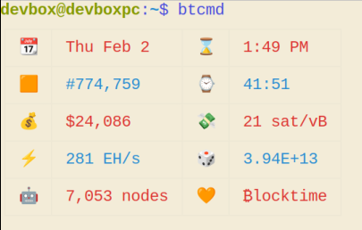

#### ₿locktime



https://user-images.githubusercontent.com/120062368/215665950-1288a0fc-420f-4e0b-b3a7-4f6c2da62705.mp4


---
##### Setup
- For setting up arduino and LCD display:
    - Verify the script `src/arduino/lcd.ino`(taken from arduino IDE Examples > SerialDisplay) and upload to your arduino
    - For the hardware setup, follow this [video](https://www.youtube.com/watch?v=_6_F6B0rd6M)
    - Make sure your data pins match the numbers in the `lcd.ino` script(not the video)
- Clone and install dependencies: 
```
    git clone https://github.com/ns-xvrn/blocktime.git &&
    cd blocktime &&
    pip install -r requirements.txt
```
- Setup `settings.conf` (copy from at same folder location):
```
    cd src &&
    cp settings.sample.conf settings.conf
```
- After you connect via USB you will have to set the read/write permissions(use name of your serial device instead of `/dev/ttyACM0`):
```
    chmod a+rw /dev/ttyACM0
```


---
##### Run


- The data updates every x minutes as setup in the `settings.conf`
```
    python3 blocktime.py console
```

```
    python3 blocktime.py lcd
```
- Video at the end for lcd display
---
##### Add aliases (OPTIONAL)

- You can create the following bash script for lcd display (named as `bt_to_lcd.sh` in below example script):
```
#!/bin/bash

sudo chmod a+rw /dev/ttyACM0
nohup python3 ~/code/xvrn/blocktime/src/blocktime.py lcd &
```

- Add aliases in your `.bashrc` and run `source .bashrc`:
```
alias btcmd="python3 ~/code/blocktime/src/blocktime.py console"
alias btlcd="~/code/blocktime/bt_to_lcd.sh"
```


